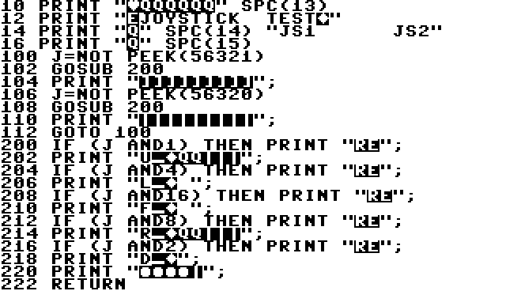

# C64 Joystick Test

## Description

Small C64 BASIC program visualising the status of the joysticks in a user 
friendly manner. When a joystick is pushed in a certain direction or the fire
button is pressed, the corresponding character (UDLRF) is highlighted.

## Deliverables

* **basic_joystick_test.png**: Screenshot of the application in action.

  

* **basic_joystick_test.bas**: The BASIC program in ASCII format,
  annotated with comments, to be tokenized with *VICE petcat* in order 
  to run it on a C64 or emulator.
* **basic_joystick_test.prg**: Tokenized version of the program. Can be
  directly run on a C64 or emulator.
* **basic_joystick_test_list.png**: Screenshot of the BASIC program
  listing. For those who wants the full experience and want to type
  it over.
  
  

  The characters in reverse text are control characters. They can be 
  entered (in quote mode) using the following lookup table.
  
  | Ctrl char      | Key combo          | Description      |
  | -------------- | ------------------ | ---------------- |
  | Q              | CursorU/D          | Cursor Down      |
  | Circle         | Shift + CursorU/D  | Cursor Up        |
  | ]              | CursorL/R          | Cursor Right     |
  | \|             | Shift + CursorL/R  | Cursor Left      |
  | Heart          | Shift + Clr/Home   | Clear screen     |
  | E              | Ctrl + 2           | White color      |
  | Diamond        | C= + 7             | Light Blue color |
  | R              | Ctrl + 9           | Reverse on       |
  | _              | Ctrl + 0           | Reverse off      |

## Code outline

The main loop endlessly polls sequentally joystick 1 and 2 and calls a
subroutine to print out the status of the joystick.

The subroutine makes extensive use of control characters to move the cursor
around and updates the characters UDLRF. This method makes that the text on
the screen remains visually stable. I.e. no flickering or scrolling occurs.

## Building with *VICE petcat*

* Download the *VICE* emulator. Add the path of the VICE binaries directory
  to your environment variables.
* Tokenize the source code with the following command:

  `petcat -w2 -o basic_joystick_test.prg -f -- basic_joystick_test.bas`

## References

* Inspired by: https://www.c64-wiki.com/wiki/Joystick
* VICE Emulator: https://vice-emu.sourceforge.io/

