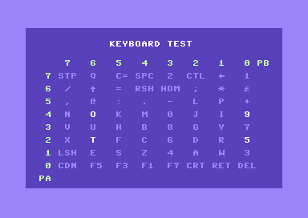
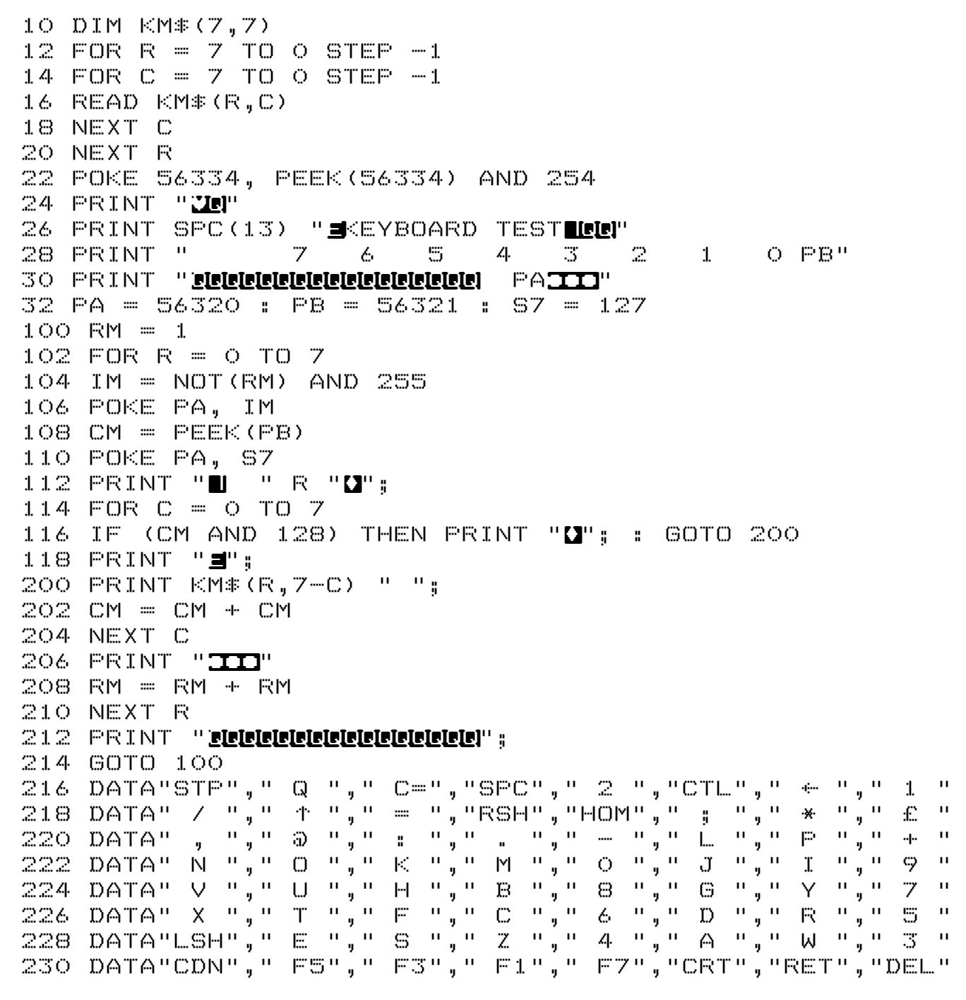

# C64 Keyboard Test

## Description

Small C64 BASIC application visualising the status of the keys in a user 
friendly manner. When one or more keys are pushed, the corresponding
keylabel on the screen is highlighted.

## Performance

As this is a BASIC program, the performance is rather slow. I.e. one
iteration of the main loop, updating the status of the 64 keys takes
about 1.7s on a PAL version of the C64. In practice, it means that
you need to hold the keys a while before the screen reflects the
pressed keys.

## Ghost keys

### Legacy C64

The C64 uses a simple keyboard matrix, where mechanical keys, when
pressed, connect a row line to a column line. There are no
diodes between the row and column lines that prevent ghost keys.
This means that if you press 3 keys of a set of 4 keys that form
the corners of a rectangle on the screen, automatically the 4th
key (the ghost key) will also be detected as pressed, though that
key is in reality not pressed.

Rectangle:
* K1 and K2 on a row line
* K3 and K4 on another row line
* K1 and K3 on a column line
* K2 and K4 on another column line

Due to lack of availability of a legacy C64, this was not tried out.

### VICE

VICE seems to emulate the keyboard matrix as in a legacy C64. Ghost keys
can be triggered. Refer also to the screenshot made with VICE. It
highlights the keys O, T, 5, 9. Remark that they are the corners of a 
rectangle. If you press only 3 of these keys, the 4th one gets
highlighted as well.

The application does not reflect the correct status of the keys, 
if more than 5 keys are pressed. Only 5 are highlighted. This is probably
a limitation of the host (Windows in my case).

### C64U

The keyboard fitted in the C64U implements something different.
Ghost keys as seen on the C64 or VICE emulator do not occur using the 
trick with 3 out of 4 keys.

The application on the C64U reflects correctly the status of the keys,
even if more than 5 are pressed at once.

## Deliverables

* **res/keyboard_test.png**: Screenshot of the application in action.

  

* **src/keyboard_test.bas**: The BASIC program in ASCII format,
  annotated with comments, to be tokenized with *VICE petcat* in order 
  to run it on a C64 or emulator.
* **bin/keyboard_test.prg**: Tokenized version of the program. Can be
  run directly on a C64 or emulator.
* **res/keyboard_test_list.png**: Picture of the BASIC program
  listing. For those who wants the full experience and want to type
  it over.
  
  

  The characters in reverse text are control characters. They can be 
  entered (in quote mode) using the following lookup table.
  
  | Ctrl char      | Key combo          | Description       |
  | -------------- | ------------------ | ----------------- |
  | Q              | CursorU/D          | Cursor Down       |
  | Circle         | Shift + CursorU/D  | Cursor Up         |
  | Heart          | Shift + Clr/Home   | Clear screen      |
  | E              | Ctrl + 2           | White color       |
  | \|             | C= + 6             | Light Green color |
  | Diamond        | C= + 7             | Light Blue color  |

## Code outline

The main loop endlessly polls sequentally all the keys by setting
Port A (PA) and reading Port B (PB) of CIA 1. Depending on the status
of the keys, the keylabels are reprinted in light blue or white color.

The subroutine makes use of control characters to move the cursor
around and change the color. This method makes that the text on
the screen remains visually stable. I.e. no flickering or scrolling occurs.

## Building with *VICE petcat*

* Download the *VICE* emulator. Add the path of the VICE binaries directory
  to your environment variables.
* Tokenize the source code with the following command:

  `petcat -w2 -o bin/keyboard_test.prg -f -- src/keyboard_test.bas`

## Extra: Assembly version
* **bin/keyboard_test_asm.prg**: A version of the application written in machine
  language. Can be run directly on a C64 or emulator.

Exactly the same look as the BASIC version of the application. Not the same
feeling. This version is much faster and very responsive. It scans all the
keys in about 3.5ms. That is more than 5 times per screen update on a PAL 
machine. 

It is also 368 bytes smaller than the bin/keyboard_test.prg.

Source code (assembly compiled with cc65) is not (yet) publicly available.

## References

* Inspired by: https://www.c64-wiki.com/wiki/Keyboard
  
  The screen layout is based on the table on this webpage.
* VICE Emulator: https://vice-emu.sourceforge.io

