# C64 Quines

## What?

A [quine](https://en.wikipedia.org/wiki/Quine_(computing)) is a computer
program that takes no input and produces a copy of its own source code as
its only output. It is a "self-replicating programs".

This topic presents some quines on the C64 using BASIC.

## A trivial quine

The obvious, trivial quine looks like this:

`10 list`

It is making use of the BASIC command `list` to display itself when run.

A more advanced version is the next one.

```
10 rem - a c64 quine -
20 list
```

More variations combining the `rem` (remark) and `list` command can be
imagined. The `rem` command allows to add some extra text in the code listing,
while the command itself does not add any output. Other lines that do not use
the `print` command but do e.g. some calculation can be added as well.

Nevertheless, these are not so interesting, in fact, rather cheating as the
heavy lifting of the program to reproduce itself is always done by the
`list` command.

## One-liners

In this section, 2 one-liners are presented. They are real quines that
consists of one single line of code and that replicates themself.  
I discovered them myself. Honestly. No cheating. But it turns out that
exactly the same ones have been described before by
Daniele Olmisani on [GitHub.io](https://mad4j.github.io/notes-quine/) and
[GitHub.com](https://github.com/mad4j/c64-codeart). Credits to Daniele.

Nevertheless, they are presented and discussed here as well.

### The string based one-liner

This one-liner uses a string that gets printed twice by the code so to say.
The string contains also the code in some way (but not interpreted). By
printing it twice, the string definition and the code appears again.

Here it is:

`10 a$ = "10 a$ = : print left$(a$,8) chr$(34) a$ chr$(34) right$(a$,55)" : print left$(a$,8) chr$(34) a$ chr$(34) right$(a$,55)`

It can be broken down to the string:

`a$ = "10 a$ = : print left$(a$,8) chr$(34) a$ chr$(34) right$(a$,55)"`

and the code:

`print left$(a$,8) chr$(34) a$ chr$(34) right$(a$,55)`

Remark that the string contains the code as well and that the code prints 3
parts of the string:
1. First the line number and the string declaration using the `left$` command.
2. Then the complete string, surrounded by the double quotes. The latter is
   is done through the command `chr$(34)`. There is no control code to insert
   a quote inline in a string. To achieve that you need to add the double
   quote to an existing string using the `chr$(34)` command.
3. Finally, the code part is printed using the `right$` command.

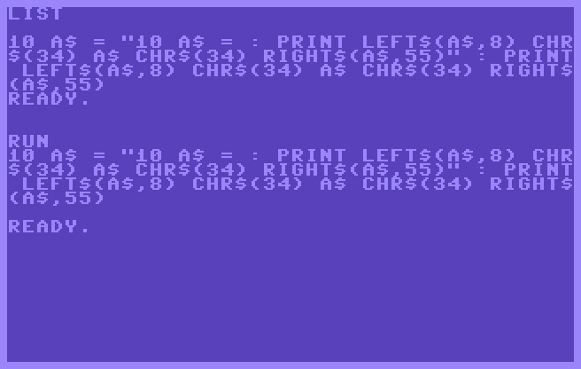

Nice! Well...  
Problem is that this piece of code is 127 characters long. As the
BASIC screen editor on the C64 only allows logical code lines of maximum 80 
characters (corresponding to 2 screen lines), you actually cannot type in this
code on the C64. The BASIC `list` command and the interpreter though support
displaying or executing longer lines respectively. To achieve longer lines,
you need some special handling to enter the code. E.g. for the screenshot,
the long source line was tokenized to a BASIC program using the *VICE petcat*
tool on a PC. So, this is not entirely satisfying.

In C64 BASIC, it is not necessarily needed to have spaces between commands.
Also, the line number can be reduced to 1 character. Let's try to remove them:

`1 a$="1 a$=:printleft$(a$,5)chr$(34)a$chr$(34)right$(a$,48)":printleft$(a$,5)chr$(34)a$chr$(34)right$(a$,48)`

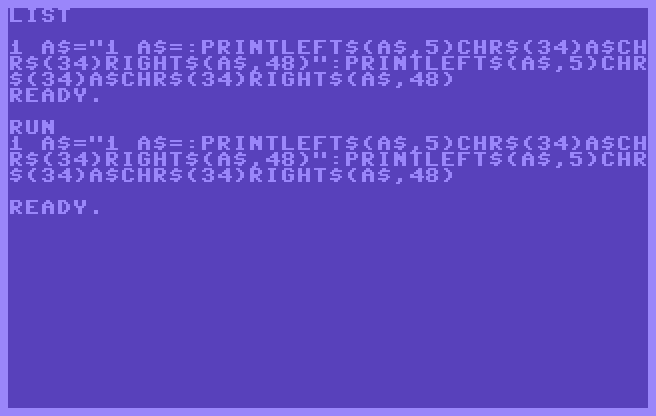

The line becomes shorter, 112 characters, but that is still too long to type
in on the C64 screen editor. It also becomes less readable.

What's next? [Abbreviations](https://www.c64-wiki.com/wiki/BASIC_keyword_abbreviation)!  
The C64 screen editor allows you to type in commands using abbreviations.
A command is reduced to 2 or 3 characters, typically the first 2 or 3
characters of the full command, where then the 2nd or 3rd character is a
capital. Applying this to the one-liner gives:

`1 a$="1 a$=:?leF(a$,5)cH(34)a$cH(34)rI(a$,34)":?leF(a$,5)cH(34)a$cH(34)rI(a$,34)`

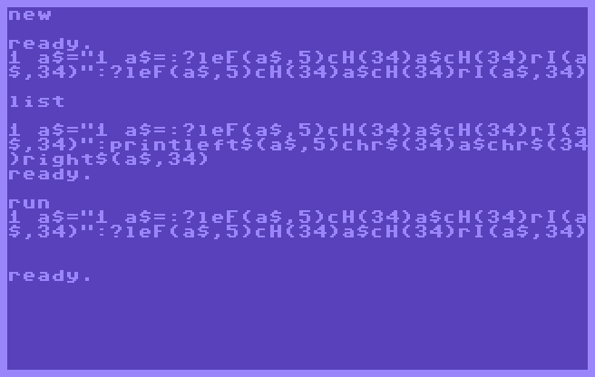

Ok, this time it is exactly 80 characters. **It can be typed in!** After entering
the last character, the cursor jumps to the next screen line (and logical
line as well). So, you need to go one line up with the cursor and then press
RETURN to effectively submit the line as part of a program.

Note that for the screenshot, the lower/UPPER character set is chosen
(*C= + Shift*), to make it more readable, though this code is even more cryptic
than the previous version.  

This version works fine. When run, it outputs exactly the 2 lines that were
entered. Only the `list` command does not show the abbreviations for the code
part, but the full length commands. This is because when long or abbreviated
commands are entered, they are stored internally as tokens. During the `list`
command, the tokens are converted back to long commands.

Further tinkering did not reveal any new or improved solutions...

### The DATA based one-liner

Let's investigate another approach. Next to storing a string in a variable,
it is also possible to store a string in a `data` statement. The advantage
of it is that there is no upfront definition needed. `data` statements can
appear anywhere in the code.

This leads to the next one-liner:

`10 read a$ : print a$ chr$(34) a$ chr$(34) : data "10 read a$ : print a$ chr$(34) a$ chr$(34) : data "`

It can be broken down to the code:

`10 read a$ : print a$ chr$(34) a$ chr$(34) : data `

followed by the string in the data statement:

`"10 read a$ : print a$ chr$(34) a$ chr$(34) : data "`

That is apart from the quotes, exactly the same. The code reads the data into
the string variable `a$` and then prints it twice, the second time surrounded
by the double quote (`chr$(34)`). 

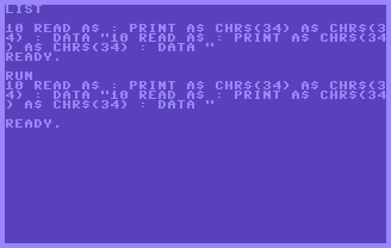

Similar as in the string based one-liner, the line is too long (102 characters)
in order to type it in the C64 screen editor. You need to create it in some
other way. But, what if we remove the spaces and reduce the line number to 1 digit:

`1 reada$:printa$chr$(34)a$chr$(34):data"1 reada$:printa$chr$(34)a$chr$(34):data"`

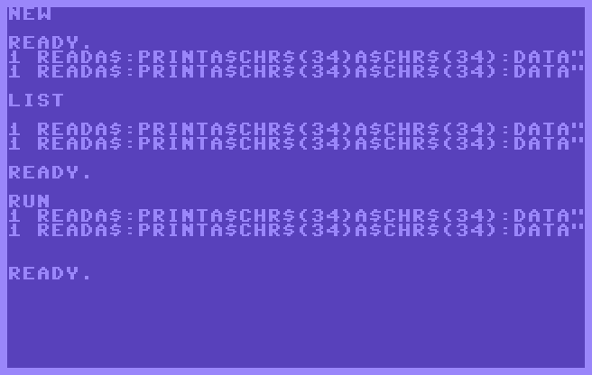

Look at that. **What an absolute beauty!** The code is exactly 80 characters long.
It can be typed in on a C64. No abbreviations needed, only the spaces have to
be removed. The typing in, the `list` and the `run` command give exactly the 
same output. And the logical output line is split over 2 screen lines, that
are on itself also exactly the same!

Note that after entering the last character, the cursor jumps to the next
screen line. So, you need to go one line up with the cursor and then press
RETURN to effectively submit the line as part of a program.

What's next? The abbreviations can be introduced here as well:

`1 rEa$:?a$cH(34)a$cH(34):dA"1 rEa$:?a$cH(34)a$cH(34):dA"`

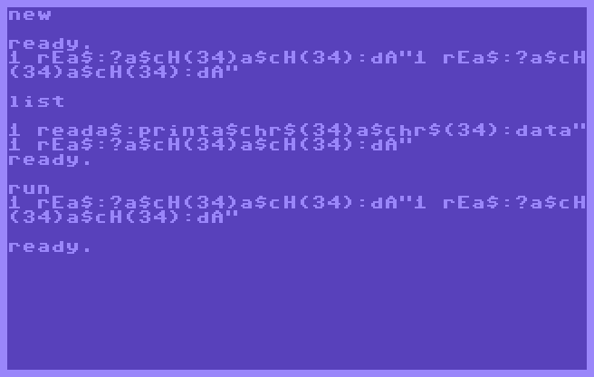

Note that for the screenshot, the lower/UPPER character set is chosen.
The expansion of the BASIC tokens to full commands during `list` though
spoils it a bit.

The line is now only 56 characters long. That gives 24 available characters
to do some things extra. E.g. smuggle in some words, like `c64 quine` into the
data string.

`1 rEa$:?rI(a$,34)cH(34)a$cH(34):dA"c64 quine1 rEa$:?rI(a$,34)cH(34)a$cH(34):dA"`

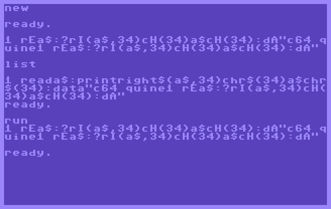

Cool. It's one line and can actually be typed in and contains some extra user data.


## Two-liners

In this section, the 2 one-liners of previous section are reworked to 
two-liners. They are a small programs that consist of 2 program lines.
The principle remains the same. One line contains a string. The other line
prints the string twice. As the string contains also the code, the program
replicates itself.

By splitting the program over two lines, the string or code is no longer
limited to +/- 40 characters (80/2) in order to fit on one logical line
or two screen lines. However, some extra characters are needed to print
the second line.

### The string based two-liner

Rewriting the string based one-liner of previous section into a two liner
gives the following code:

```
10 a$="10 a$=20 print left$(a$,6) chr$(34) a$ chr$(34) : print right$(a$,63)"
20 print left$(a$,6) chr$(34) a$ chr$(34) : print right$(a$,63)
```

As there is room, the code is written fully out in the string, even the 
spaces are included (apart from spaces around the equal sign in the string
declaration). The first line takes 78 characters. Typing in, listing it and
running it, gives the same code back.

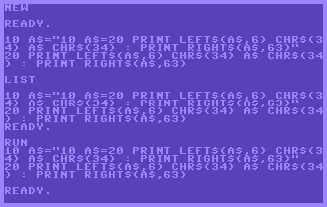

This can be further compressed by removing the spaces and using the
abbreviations for the commands. Though, as explained before, using the
abbreviatons, breaks the `list` command. This gives:

```
1 a$="1 a$=2 ?leF(a$,5)cH(34)a$cH(34):?rI(a$,37)"
2 ?leF(a$,5)cH(34)a$cH(34):?rI(a$,37)
```

The first line is only 49 characters long. Hence there is room to add some
comments. For example:

```
1 a$="1 a$=2 ?leF(a$,5)cH(34)a$cH(34):?rI(a$,67):rem ****** a c64 quine ******"
2 ?leF(a$,5)cH(34)a$cH(34):?rI(a$,67):rem ****** a c64 quine ******
```

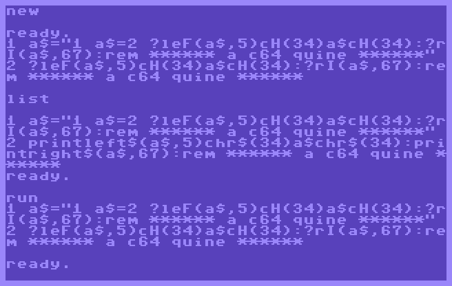

This one has 79 characters for the first line, and room for a comment of 25 characters.

### The DATA based one-liner

Rewriting the non-compressed DATA based one-liner of previous section into a
two liner gives the following code:

```
1 reada$:printleft$(a$,62):printright$(a$,7)chr$(34)a$chr$(34)
2 data "1 reada$:printleft$(a$,62):printright$(a$,7)chr$(34)a$chr$(34)2 data "
```

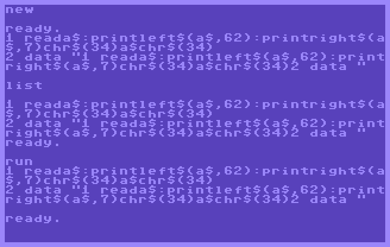

The program can be typed in as lines are less than 80 characters, full commands
can be used, though spaces needs to be removed. So, typing it in, listing it or
running it gives always the same result. However, line 2 takes 78 characters.

It is a bit surprising, the one-liner version was just 80 characters. Splitting
it up in 2 lines should give some extra room. However the actual code goes from:

`1 reada$:printa$chr$(34)a$chr$(34):data`

to:

`1 reada$:printleft$(a$,62):printright$(a$,7)chr$(34)a$chr$(34)`

There is a second print command needed for the second line and the data value
needs to be cut into pieces using `left$` and `right$` commands. These extra
commands for generating a second line eat up all the possible extra space on
line 2.

So, this quine can not be extended further without using the abbreviations.
At that moment some extra words can be added in the data string.

```
1 rEa$:?leF(a$,66):?rI(a$,5)cH(34)a$cH(34):rem **** c64 quine ****
2 dA "1 rEa$:?leF(a$,66):?rI(a$,5)cH(34)a$cH(34):rem **** c64 quine ****2 dA "
```

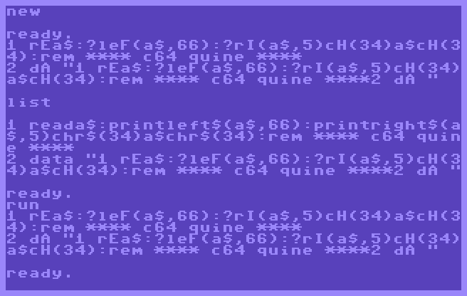

This quine has 78 characters for the second line, and room for a comment of
19 characters.


## Three-liner

What about a quine of 3 lines? Yes. Possible. Here it is:

```
1 rem c64 quine
2 a$="1 rem c64 quine2 a$=3 ?leF(a$,15):?mI(a$,16,5)cH(34)a$cH(34):?rI(a$,51)"
3 ?leF(a$,15):?mI(a$,16,5)cH(34)a$cH(34):?rI(a$,51)
```

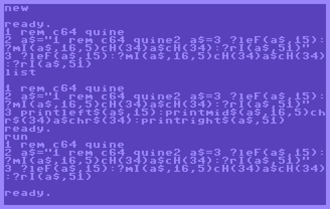

Again, abbreviations are used, which get expanded using the list command.
Spaces are removed and the longest line is 78 characters which makes it
possible to type it in.


## A generic quine

One can keep going on like this. Add yet another line, and another one...
After all the tinkering with the previous quines, it was time to take it
a step up. The idea came up to create a more generic quine:

* Lines are shorter than 80 character in order to allow typing it over.
* Full commands instead of abbreviations, in order to have also a
  matching listing after the `list` command.
* Spacing of the commands for increased readability of the code.
* Listing and running give exactly the same output.
* Variable number of additional dummy lines. A dummy line is a data line or
  a remark line. It allows to convey some message, but does not generate
  side effects or outputs when executed.
* Easily extendable, without too much difficulties.


### DATA in front of the code

The quine looks like this:

```
1 data "data  "
2 data "! a generic c64 basic quine !"
3 data "1000 read d$: d$=left$(d$,5): restore: q$=chr$(34): i=0"
4 data "1001 i=i+1: u$=v$: v$=w$: w$=x$: x$=y$: y$=z$"
5 data "1002 i$=str$(i)+chr$(32): i$=right$(i$,len(i$)-1): read z$"
6 data "1003 print i$ d$ q$ z$ q$: if z$<>d$ goto 1001"
7 data "1004 r$=chr$(13): print u$ r$ v$ r$ w$ r$ x$ r$ y$"
8 data "data "
1000 read d$: d$=left$(d$,5): restore: q$=chr$(34): i=0
1001 i=i+1: u$=v$: v$=w$: w$=x$: x$=y$: y$=z$
1002 i$=str$(i)+chr$(32): i$=right$(i$,len(i$)-1): read z$
1003 print i$ d$ q$ z$ q$: if z$<>d$ goto 1001
1004 r$=chr$(13): print u$ r$ v$ r$ w$ r$ x$ r$ y$
```

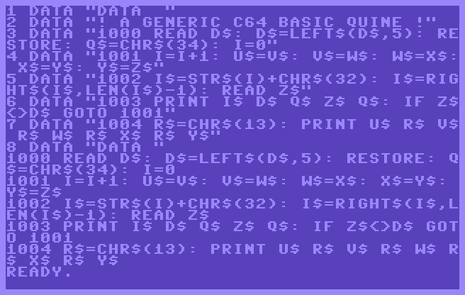

The different requirements are met. The quine consists of:
* A DATA part at the beginning.
  - Line 1 contains `data  `. This is used a heredoc delimiter, but also 
    as a helper string to re-print the DATA section.
  - Line 2 is a dummy line. Its content can be defined freely.
  - Lines 3 to 7 are a duplication of the code at lines 1000 to 1004.
  - Line 8 contains again the heredoc delimiter, but now with only one
    space at the end.
* The code part
  - Line 1000 reads first the delimiter and drops the last space, in order
    to detect the end of the data section. Then it rewinds the read pointer.
  - Lines 1001 to 1003 form a while loop to re-print the DATA part.
    It reads the data line by line and prints it with an incrementing line
    number the `data` keyword and quotes. Note that it also stores the last
    6 data lines in variables `u$, v$, w$, x$, y$, z$` by shifting them
    through per iteration. The loop is ended at the moment the last read
    string equals the delimiter.
  - Line 1004 prints then last 5 but 1 read lines using the variables. This
    results in the reprint of the code.

This quine is generic: one can add additional lines in the data section
between line 1 and 3 in the above snippet. But make sure to renumber them
and keep the code and delimiters as is. E.g. a new DATA section can look like:

```
1 data "data  "
2 data "! a generic c64 basic quine !"
3 data "here is an extra line"
4 data "and... yet another extra line"
5 data "1000 read d$: d$=left$(d$,5): restore: q$=chr$(34): i=0"
6 data "1001 i=i+1: u$=v$: v$=w$: w$=x$: x$=y$: y$=z$"
7 data "1002 i$=str$(i)+chr$(32): i$=right$(i$,len(i$)-1): read z$"
8 data "1003 print i$ d$ q$ z$ q$: if z$<>d$ goto 1001"
9 data "1004 r$=chr$(13): print u$ r$ v$ r$ w$ r$ x$ r$ y$"
10 data "data "
```

Lines can be added till line 999.


### DATA after the code

If the previous quine is reworked to have the code in front, then it looks like:

```
1 read w$, x$, y$, z$, d$: d$=left$(d$,5): q$=chr$(34): i=9
2 r$=chr$(13): s$=chr$(32): print w$ r$ x$ r$ y$ r$ z$: restore
3 i=i+1: i$=str$(i)+s$: i$=right$(i$,len(i$)-1): read z$
4 print i$ d$ q$ z$ q$: if z$<>d$ goto 3
10 data "1 read w$, x$, y$, z$, d$: d$=left$(d$,5): q$=chr$(34): i=9"
11 data "2 r$=chr$(13): s$=chr$(32): print w$ r$ x$ r$ y$ r$ z$: restore"
12 data "3 i=i+1: i$=str$(i)+s$: i$=right$(i$,len(i$)-1): read z$"
13 data "4 print i$ d$ q$ z$ q$: if z$<>d$ goto 3"
14 data "data  "
15 data ""
16 data "! a generic c64 basic quine !"
17 data ""
18 data "data "
```

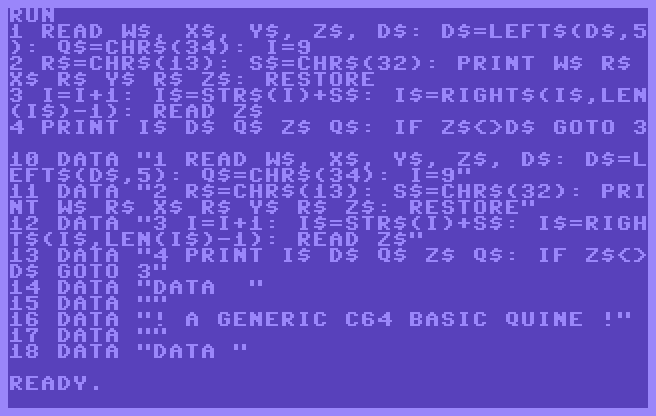

The principle is the same as before. In 5 variables, the code reads itself from
the DATA section and prints it. Then the read pointer is rewound and the data is
again fully reprinted.

The advantage of this one is that you only need to add lines at the end and not
need to renumerate the data lines holding the code. Just make sure that the last
line contains `data "data "`.

### Final version

Looking at the previous quines, more in particular the screenshots, it is not
that visually appealing. Therefore additional requirements are added:

* Lines are less than 40 characters.
* The minimal version takes less than 25 lines.

I.e. the logical line fits on one screen line. In practice it means that a
code line should be limited to 29 characters. When it is put in a data
statement, it still fits on one screen line. By limiting it to 25 lines,
it also fits on one screen.

That gives:

```
1 read d$: rem * a c64 quine *
2 q$=chr$(34): s$=chr$(32): i=0
3 i=i+1: i$=mid$(str$(i),2)
4 read a$: if a$=d$ goto 6
5 print i$ s$ a$: goto 3
6 restore: d$=d$+s$
7 i$=mid$(str$(i),2): read a$
8 print i$ s$ d$ q$ a$ q$
9 i=i+1: if a$<>d$ goto 7
10 data "data"
11 data "read d$: rem * a c64 quine *"
12 data "q$=chr$(34): s$=chr$(32): i=0"
13 data "i=i+1: i$=mid$(str$(i),2)"
14 data "read a$: if a$=d$ goto 6"
15 data "print i$ s$ a$: goto 3"
16 data "restore: d$=d$+s$"
17 data "i$=mid$(str$(i),2): read a$"
18 data "print i$ s$ d$ q$ a$ q$"
19 data "i=i+1: if a$<>d$ goto 7"
20 data "data"
21 data "> add here more text lines <"
22 data "data "
```

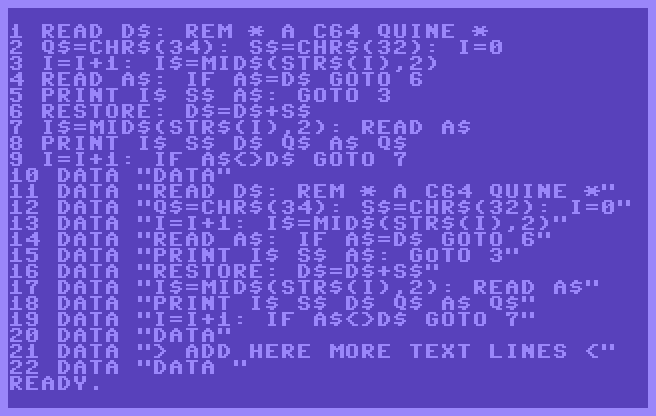

Much better!

Few modifications compared to the previous 2 versions. The delimiter `"data"`
appears now 3 times. This is because there are now 2 while loops in the code.  
A first while loop (line 3 to 5) prints the code, found between the 1st and 
2nd delimiter. So, there is no longer a need for storing the code in a set
of variables for later reuse.  
The second loop (line 7 to 9) reprints the data lines, between the 1st and
3rd delimiter.

Extending the quine can be done using the same approach as the previous one.


## LIST revisited

The trivial quine uses the list command:

`10 list`

But that is cheating. What if the `list` command is partially reimplemented in
BASIC itself? And that programs lists then itself?

Refer to the [BASIC technical details](https://www.c64-wiki.com/wiki/BASIC) to
understand how BASIC lines are stored in memory. BASIC lines start at address
2049. A BASIC line has the following format:

* Bytes 0 and 1 are the memory address for the next line. When they are
  0, the end of the program is reached.
* Bytes 2 and 3 are the BASIC line number in binary format. This needs to be
  printed.
* Bytes 4 to n-1 is the instruction using BASIC tokens.
* Byte n is 0 and a terminator. It indicates the end of the BASIC line.

For bytes 4 to n-1, values lower than 128 can just be printed again using
`chr$()`. Values 128 and above are the BASIC tokens, referring to a BASIC
keyword. These must be expanded to the full word.

Given that information, the minimum quine looks like:

```
0 a=2049: rem c64 quine, list revisited
2 if peek(a)=0 and peek(a+1)=0 then end
4 a=a+2: l=peek(a)+256*peek(a+1)
6 print mid$(str$(l),2) " ";: a=a+2
8 v=peek(a): a=a+1
10 if v=0   then print         : goto 2
12 if v<128 then print chr$(v);: goto 8
14 if v=167 then print "then"; : goto 8
16 if v=153 then print "print";: goto 8
18 if v=137 then print "goto"; : goto 8
20 if v=139 then print "if";   : goto 8
22 if v=178 then print "=";    : goto 8
24 if v=170 then print "+";    : goto 8
26 if v=194 then print "peek"; : goto 8
28 if v=172 then print "*";    : goto 8
30 if v=179 then print "<";    : goto 8
32 if v=196 then print "str$"; : goto 8
34 if v=199 then print "chr$"; : goto 8
36 if v=202 then print "mid$"; : goto 8
38 if v=143 then print "rem";  : goto 8
40 if v=175 then print "and";  : goto 8
42 if v=128 then print "end";  : goto 8
```

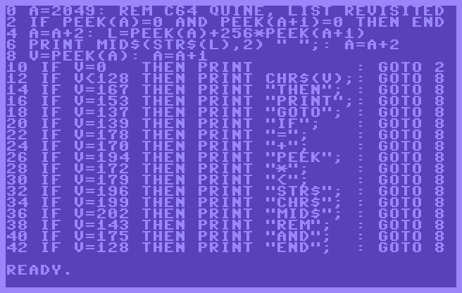

So... that's it for the moment.